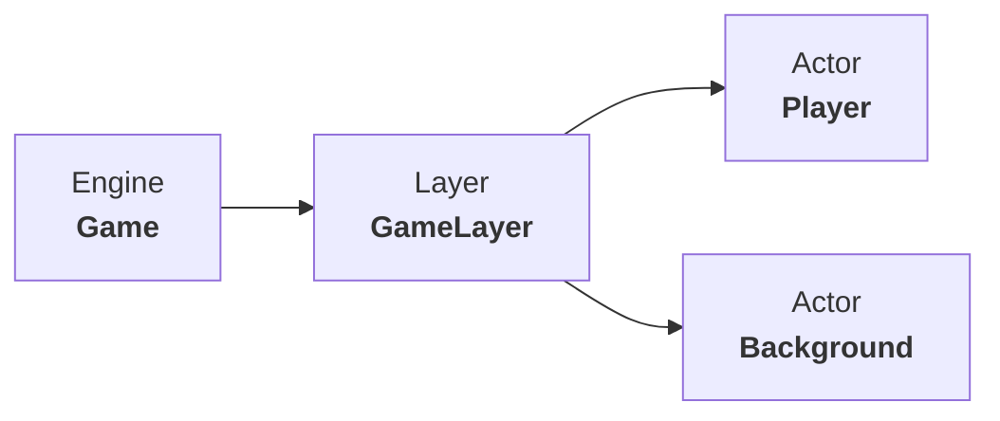

# Juego de naves espaciales

[English](README.md) | Español

## Descripción

El proyecto se trata de un pequeño videojuego. Consiste en una nave capaz de disparar y destruir enemigos que van apareciendo a lo lejos.

La implementación está escrita en C++ y se utilizan las dependencias encontradas en la carpeta de videojuegos que debe dejarse en el disco C: para que funcione.

**Universidad de Oviedo**
Cuarto año del grado en Ingeniería Informática del Software

**Asignatura**: Software de Entretenimiento y Videojuegos (SEV)
	
## Arquitectura

