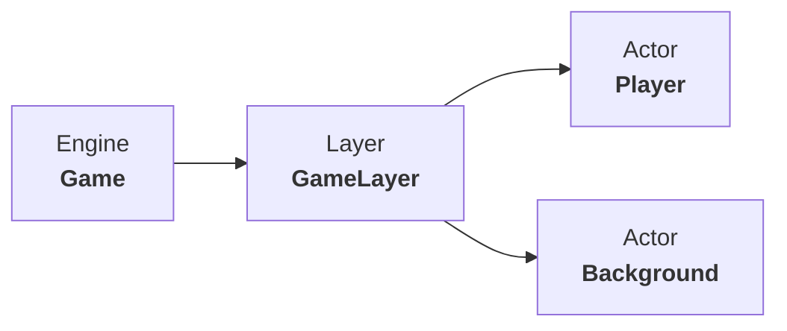

# Spaceship game

[English](README.md) | Español

## Description

This project is a small video game. It consists of a spaceship capable of shooting and destroying enemies that appear in the distance.

The implementation is written in C++ and uses the dependencies located in the video games folder, which must be placed in drive C: to function properly.

**University of Oviedo**
Fourth year of the Bachelor's Degree in Software Engineering

**Subject**: Entertainment and Video Game Software (SEV)
	
## Arquitectura

